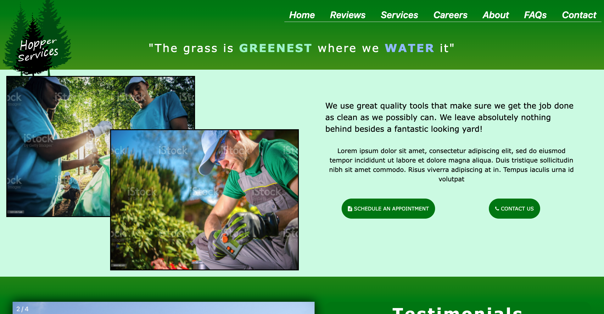
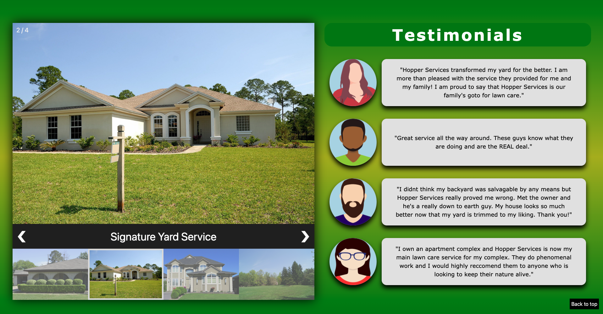
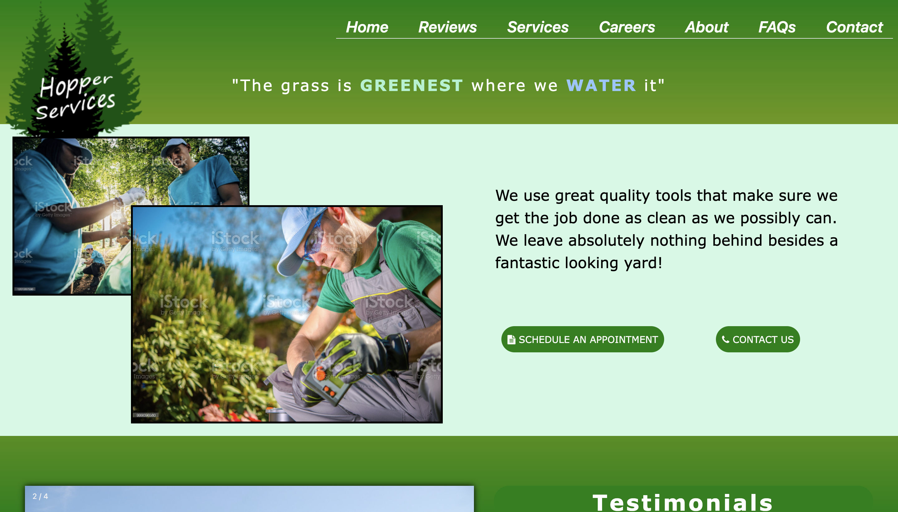
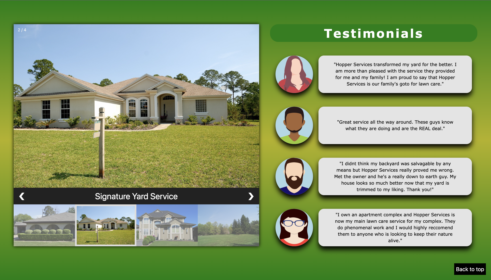
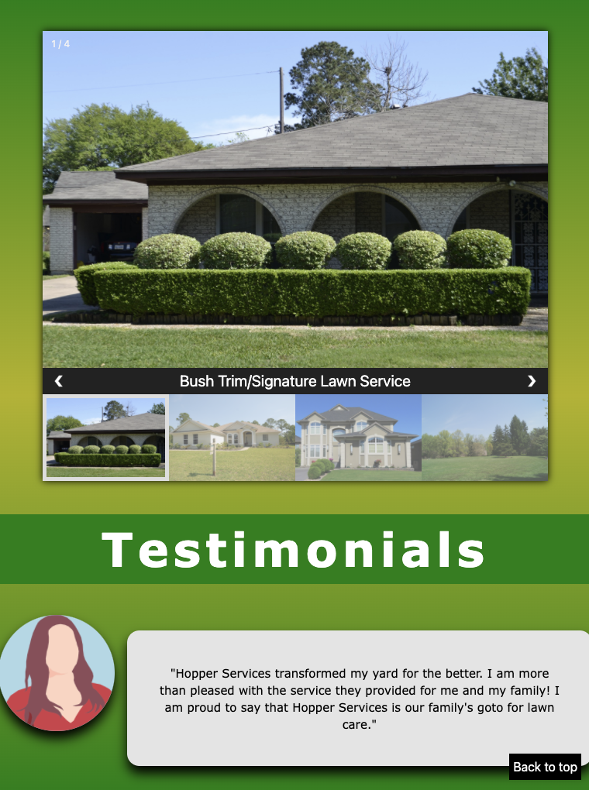
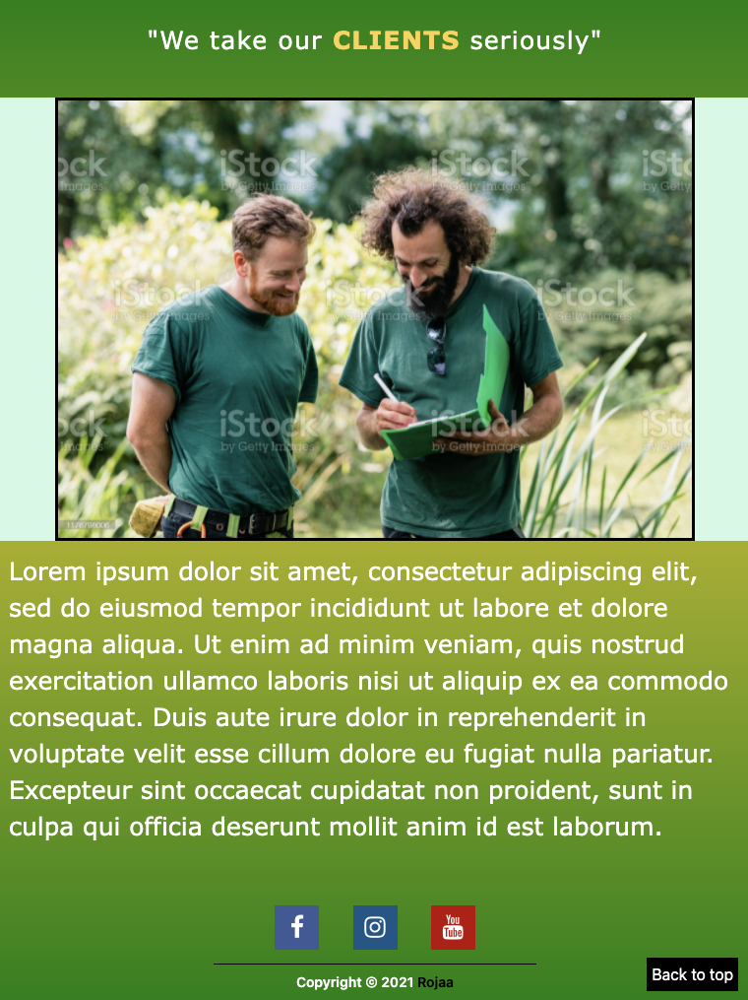
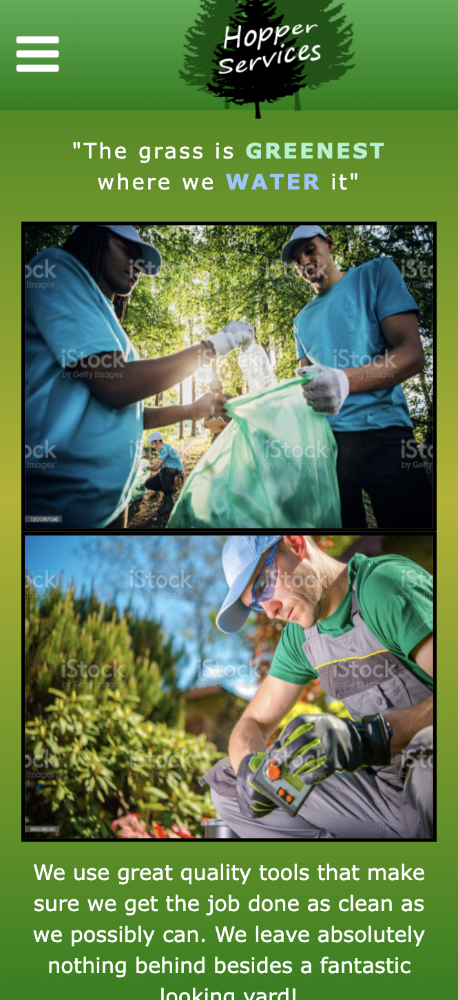
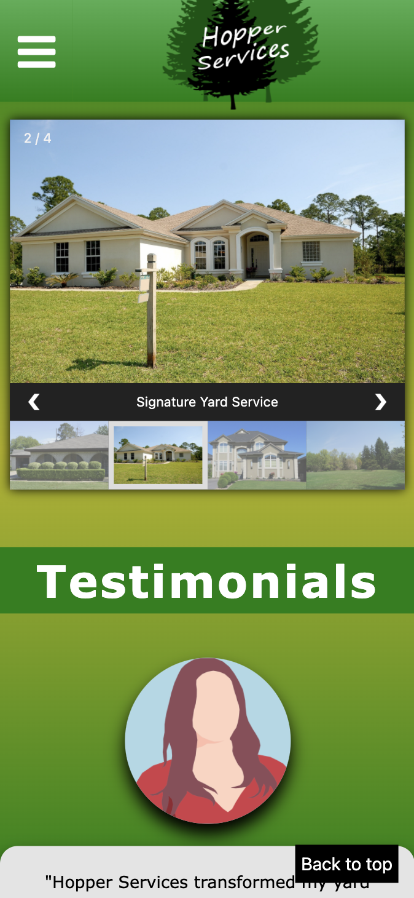
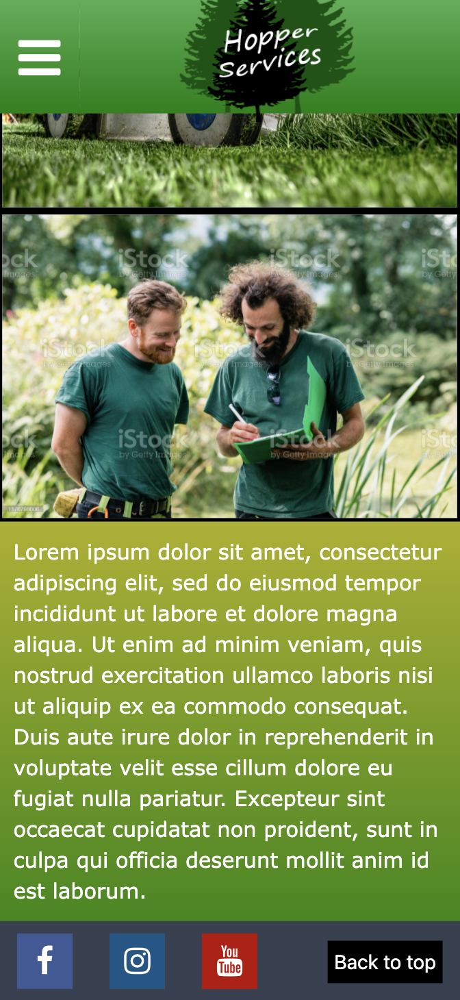

<h1>Hopper Services</h2>
<h3>Framework Used:</h3>

<h3>Languages Used:</h3>

 
This is a website for a made up lawn care company I did in order to practice some of my skills and creativity. My main focus of this project was to touch on responsiveness utilizing tailwind's built in media queries. I created the logo using Photoshop in order to give the website a more professional look. Responsiveness is the most important aspect nowadays in creating websites so this was a great opportunity for me to practice with just that.
 
 

<b>below are examples of how the site is displayed on different screen sizes</b>

<h2>Wide Screen</h2>

<h2>Large Screen</h2>

<h2>iPad</h2>

<h2>iPhone X</h2>

Thank you!
